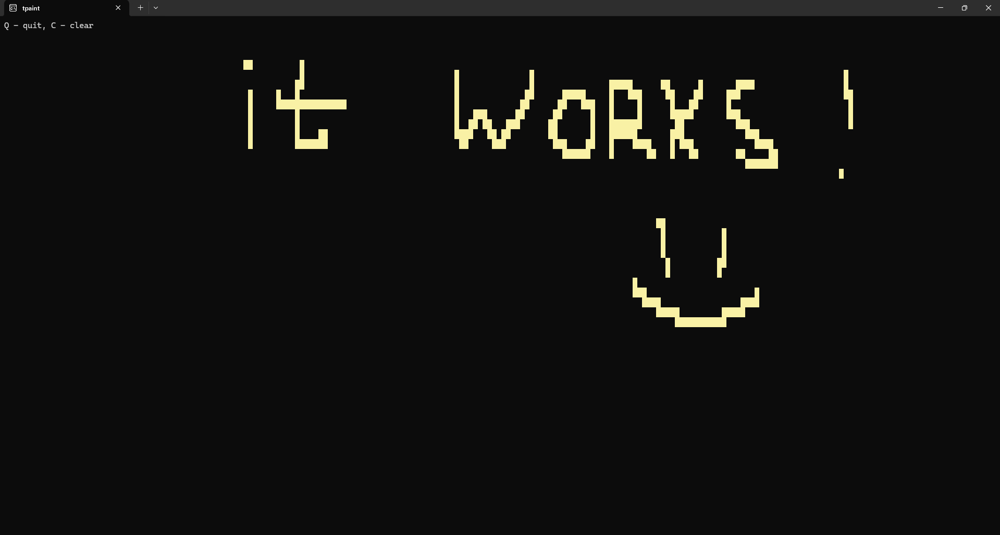

# tpaint

This is a simple interactive terminal application written in Go using the tcell library. It allows users to draw on the terminal screen using the mouse.

## Installation

```bash
go install github.com/weldnor/tpaint@latest
```

## Screenshots

